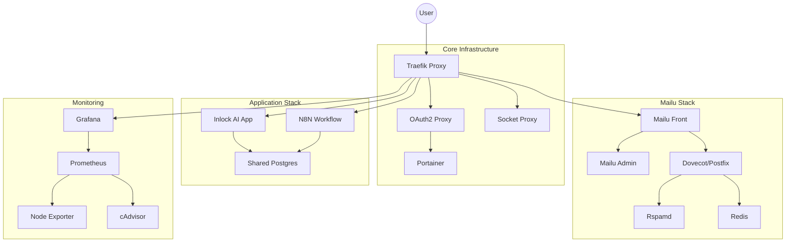

# Container Architecture & Structure

**Status:** Active (Production)
**Last Updated:** Dec 2025

This document outlines the containerized service architecture of the Inlock AI infrastructure.

## 🏗 High-Level Overview

The system is composed of **4 primary stacks**, orchestrating ~15 containers.

## 📦 Service Stacks

### 1. Core Infrastructure
Foundational services that manage routing, security, and orchestration.

| Service | Image | Purpose | Configuration |
|---------|-------|---------|---------------|
| `traefik` | `traefik:v2.10` | Edge Router / Reverse Proxy | `traefik/` |
| `socket-proxy` | `tecnativa/docker-socket-proxy` | Secures Docker Socket | Read-only access for Traefik |
| `oauth2-proxy` | `bitnami/oauth2-proxy` | Auth0 SSO Integration | `.env` |
| `portainer` | `portainer/portainer-ce` | Container Management UI | `mgmt` network only |

### 2. Application Stack
The core business logic and automation engine.

| Service | Image | Purpose | Dependencies |
|---------|-------|---------|--------------|
| `inlock-ai` | `comzis/inlock-ai` | Main Web Application | Postgres, Redis |
| `n8n` | `n8nio/n8n` | Workflow Automation | Postgres |
| `inlock-db` | `postgres:15` | Application Database | - |
| `postgres` | `postgres:14` | N8N Database | - |

### 3. Mailcow Stack (Email)
Mailcow runs outside this repo at `/home/comzis/mailcow`.

*   **Nginx**: Web UI and admin access.
*   **Postfix**: SMTP handling.
*   **Dovecot**: IMAP/POP handling.
*   **Rspamd**: Spam filtering.
*   **MySQL/Redis**: Backend services.
*   **SOGo**: Webmail/groupware.

### 4. Monitoring Stack
Observability and health tracking.

*   **Prometheus**: Time-series database collecting metrics.
*   **Grafana**: Visualization dashboard.
*   **Alertmanager**: Alert dispatching.
*   **Node Exporter**: Host system metrics.
*   **cAdvisor**: Container resource metrics.

## 💾 Volume Strategy (Persistence)

We use a mix of **Docker Volumes** (for managed data) and **Bind Mounts** (for config/logs).

### Docker Volumes (Data)
These are backed up nightly via `scripts/backup-volumes.sh`.

| Volume Name | Service | Content |
|-------------|---------|---------|
| `inlock_db_data` | App DB | Main application data |
| `n8n_data` | N8N | Workflow execution history |
| `prometheus_data` | Monitoring | Metric history |
| `grafana_data` | Monitoring | Dashboard definitions |

Mailcow data lives under `/home/comzis/mailcow/data` and is managed separately.

### Bind Mounts (Config)
These map to files in the git repository or host secrets.

| Host Path | Container Path | Purpose |
|-----------|----------------|---------|
| `./compose/*.yml` | - | Service definitions |
| `./traefik/dynamic/` | `/etc/traefik/dynamic/` | Traefik routing rules |
| `./secrets/` | `/run/secrets/` | **Secrets** (Not in git) |
| `./scripts/` | (Various) | Automation scripts |

## 🔄 Lifecycle Management

*   **Deploy**: via GitHub Actions (Tag-based).
*   **Update**: via `deploy.yml` or manual `docker compose pull`.
*   **Backup**: Nightly `pg_dump` + Volume Encrypted Tars.
*   **Logs**: JSON-file driver with rotation (10m size, 3 files).
