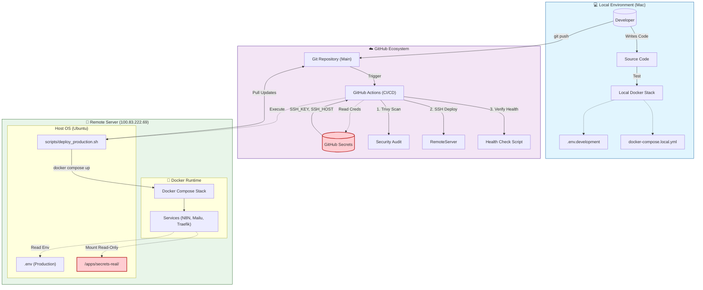
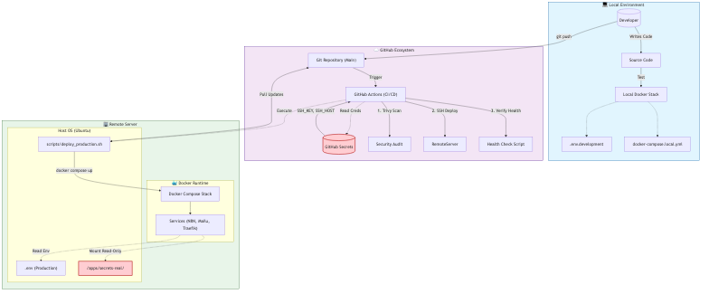

# Inlock AI - DevOps Architecture & Workflow

This document illustrates the complete DevOps lifecycle, from local development to production deployment, highlighting key components and security boundaries.

## Recommended Practices

### 1. Local Development
*   **Use `docker-compose.local.yml`**: Do not try to run the production stack locally. The local compose file is optimized for macOS networking and performance.
*   **`.env.development`**: Keep a local-only env file for dev keys. Never commit this.

### 2. Secret Management
*   **Production**: Store actual secrets (API keys, DB passwords) in `/home/comzis/apps/secrets-real/` on the server.
*   **Injection**: These are mounted into containers as Docker Secrets (files), typically at `/run/secrets/<name>`.
*   **Environment Variables**: Use `.env` *only* for non-sensitive config (domain names, flags).

### 3. Deployment Flow
1.  **Commit**: Changes pushed to `main` trigger the pipeline.
2.  **Scan**: Trivy scans for vulnerabilities.
3.  **Deploy**: GitHub Actions SSHs into the server and runs `deploy_production.sh`.
4.  **Verify**: The pipeline runs `health_check_remote.sh` to confirm the site is up.
