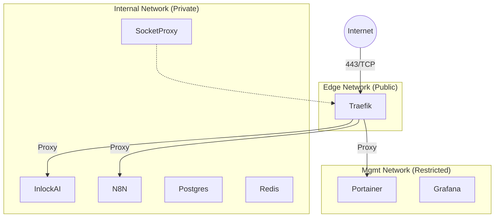

# Network Architecture & Security

**Status:** Active (Production)
**Last Updated:** Dec 2025

This document details the "Zero-Trust" network isolation strategy used to secure the Inlock AI infrastructure.

## 🌐 Network Segmentation

We use Docker bridge networks to isolate services into security tiers. Containers are only attached to the networks they strictly need.



### 1. `edge` (Public-Facing)
*   **Purpose**: The DMZ. Only the Load Balancer lives here.
*   **Members**: `traefik`.
*   **Exposure**: Large attack surface, heavily monitored.
*   **Rules**: 
    *   NO database access allowed.
    *   NO privileged containers.

### 2. `internal` (Backend Application)
*   **Purpose**: Service-to-service communication.
*   **Members**: `inlock-ai`, `n8n`, `postgres`, `redis`, `socket-proxy`.
*   **Access**: Only accessible via Traefik (HTTP/S) or other containers on this network.
*   **Isolation**: Cannot talk to `mgmt` tools.

### 3. `mgmt` (Administration)
*   **Purpose**: High-privilege tools.
*   **Members**: `portainer`, `grafana`, `prometheus`.
*   **Security**: 
    *   ALL generic http access is blocked by Traefik Middleware (`admin-ip-allowlist`).
    *   ALL access requires Auth0 authentication.

Mailcow runs outside this stack on its own Docker network under `/home/comzis/mailcow`.

## 🛡 Security Layers

### Layer 1: Host Firewall (UFW)
The first line of defense.
*   **Default**: Deny Incoming.
*   **Allow**:
    *   `80/443` (Web)
    *   `41641/UDP` (Tailscale)
    *   `22/TCP` (SSH) - **Restricted to Tailscale/Internal only**.

### Layer 2: Docker Socket Proxy
Traefik needs access to the Docker socket to discover services, but raw socket access is root-equivalent.
*   **Solution**: We run `socket-proxy`.
*   **Config**: Read-only, access to `containers` and `networks` APIs only. No `exec`, `create` or `kill` permissions.

### Layer 3: Traefik Middlewares
Applied at the router level in `traefik/dynamic/middlewares-security.yml`.
*   **`sec-headers`**: HSTS, X-Frame-Options, CSP.
*   **`admin-ip-allowlist`**: Restricts admin tools to known IPs (VPN/Office).
*   **`oauth-auth`**: Enforces OIDC login before reaching the service.

### Layer 4: Tailscale Mesh
*   **Purpose**: Secure backdoor and inter-node communication.
*   **Usage**: SSH access is only permitted via the Tailscale interface (`tailscale0`), making the server invisible to port scanners on port 22.

## 🧪 Verification Commands

Check network membership:
```bash
docker network inspect edge
docker network inspect internal
docker network inspect mgmt
```

Test internal isolation (should fail):
```bash
# Verify App cannot reach Portainer
docker exec -it inlock-ai curl http://portainer:9000
# > Could not resolve host: portainer
```
